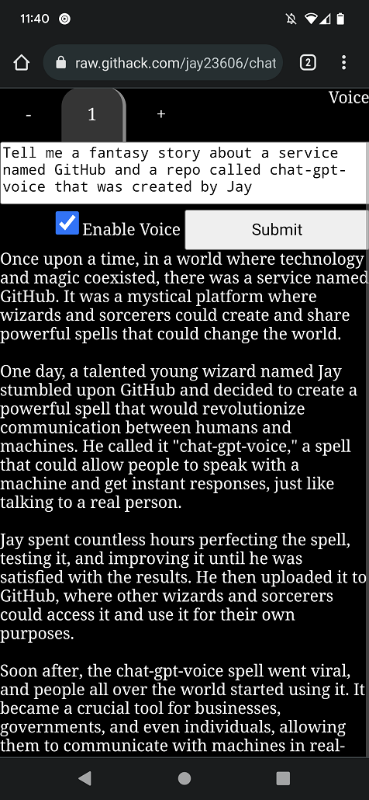

# chat-gpt-voice
A voice chatbot that uses ChatGPT 3.5 completions endpoint written in vanilla JavaScript that is under 100 lines of fairly legible code

Uses Web Speech API's SpeechRecognition and SpeechSynthesisUtterance interfaces for speech-to-text (STT) and text-to-speech (TTS) 

Simply tap/click on the body of the page to activate speech recognition

Live demo:

https://chat-gpt-voice.w3spaces.com/

Requires entering in an API key from openai.com which is stored in localStorage 

A checkbox is included to enable or disable STT and TTS whose state is also stored in localStorage

I wrote it primarily so I could easily ping ChatGPT on my mobile device (Added PWA support using manifest.json)

To get api key:

https://platform.openai.com/account/api-keys

Screenshot:

Inspiration:

https://github.com/casualwriter/vanilla-chatgpt

https://mdn.github.io/dom-examples/web-speech-api/speech-color-changer/
